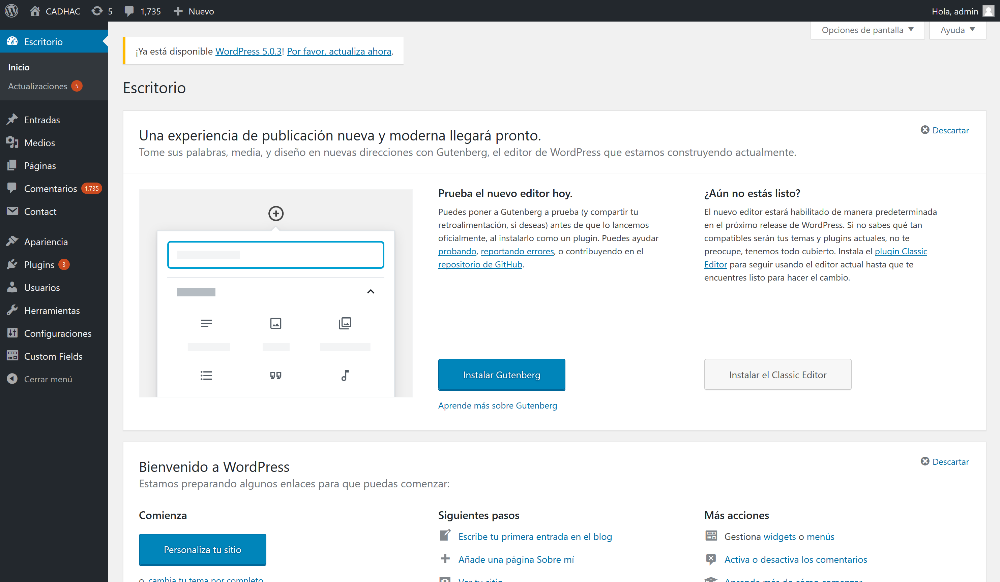
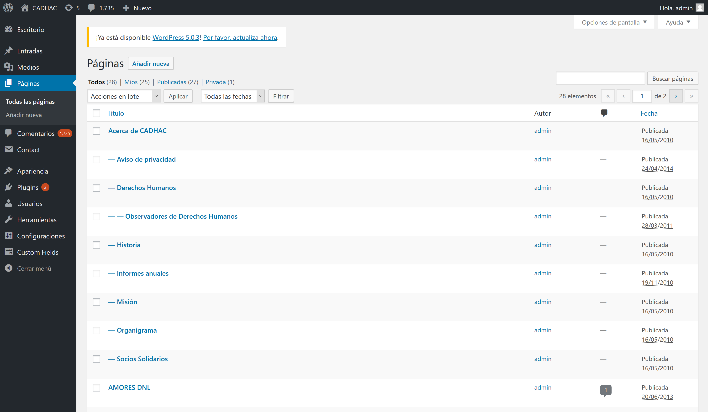
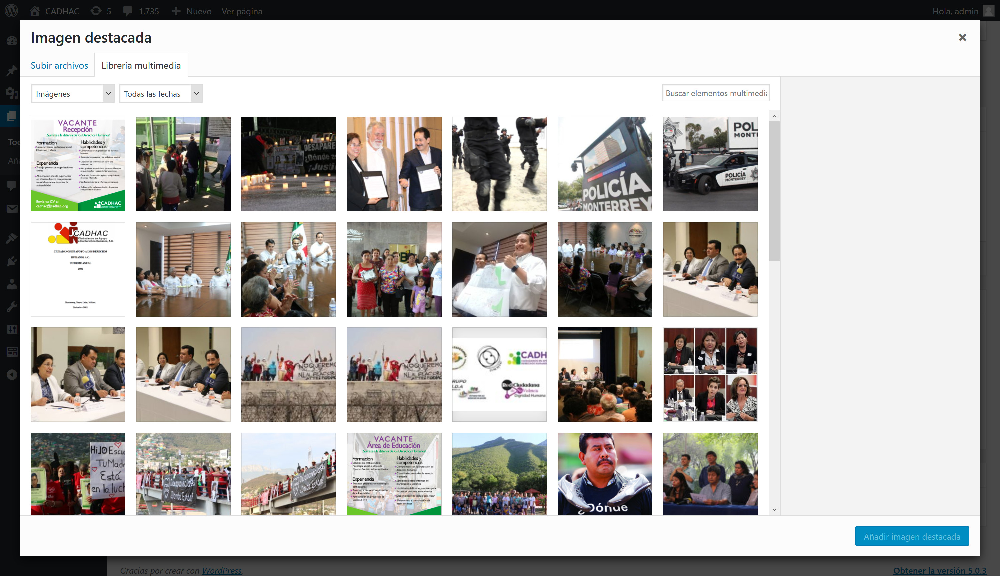

# Tutorial: banners en CADHAC WordPress

| | |
| - | - |
| **Fecha de elaboraci&oacute;n** | 18 de enero de 2019 |
| **Ultima actualizaci&oacute;n** | 18 de enero de 2019  |
| **Elabor&oacute;** | H&eacute;ctor Rinc&oacute;n <hecerinc@outlook.com> |

A continuación se describe el proceso para cambiar los banners de las páginas internas del sitio en WordPress de CADHAC.

## Introducci&oacute;n

Supongamos que queremos cambiar el banner de la p&aacute;gina de **Qu&eacute; hacemos**

## 1. Entrar al administrador

Esta es la pantalla default del Dashboard de WordPress.

## 2. Entrar a la secci&oacute;n de p&aacute;ginas

En el menu izquierdo del dashboard hay un bot&oacute;n que dice "**P&aacute;ginas**". Hacer click en el bot&oacute;n.

Esto nos va a llevar al listado de p&aacute;ginas del sitio:

Aqu&iacute; hay que buscar la p&aacute;gina que queremos cambiar. Para ello se puede utilizar el buscador en la parte superior derecha o ir buscando en las p&aacute;ginas del listado.

## 3. Subir una imagen destacada

Al hacer click sobre el resultado, entraremos a la edici&oacute;n de la p&aacute;gina. En esta p&aacute;gina hay una secci&oacute;n en la parte inferior derecha que se llama **Imagen destacada**.

Aqu&iacute; es donde hay que subir la imagen nueva del banner.

## 4. Subir la imagen

Al hacer click sobre la imagen se abre la librer&iacute;a de media de WordPress. Se puede seleccionar una imagen anteriormente cargada al sitio de la librer&iacute;a que aparece por default. 

Si se desea subir una imagen nueva, se puede arrastrar a esta secci&oacute;n o seleccionar la pesta&ntilde;a de **Subir archivo** que se encuentra en la parte superior izquierda.

Una vez seleccionada la imagen, hacer click en el bot&oacute;n de **A&ntilde;adir imagen destacada** en la parte inferior derecha.

## 5. Guardar la entrada

Una vez que se ha seleccionado la imagen, es necesario guardar los cambios a la p&aacute;gina.

En la parte superior derecha de la p&aacute;gina de edici&oacute;n, hay una secci&oacute;n que se llama **Publicar**.

En esta secci&oacute;n hay que hacer click en el bot&oacute;n de **Actualizar** para guardar los cambios.

Una vez hecho este proceso se deber&iacute;a reflejar el cambio de banner en el sitio p&uacute;blico.

